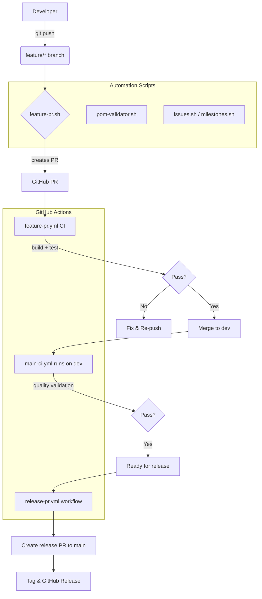
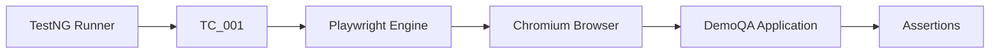
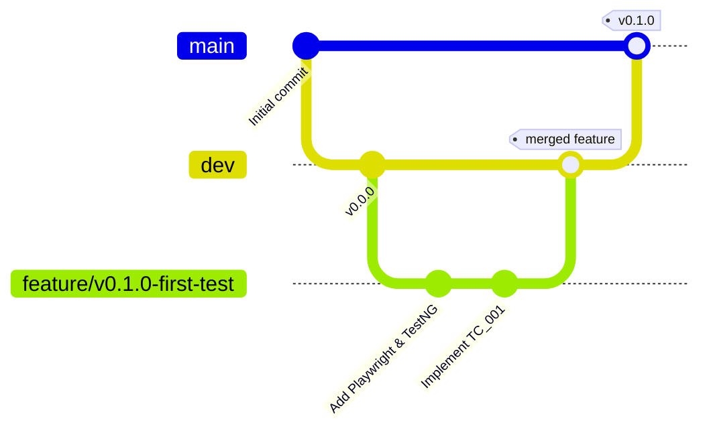
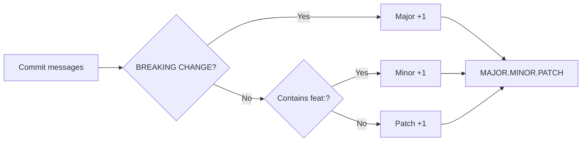
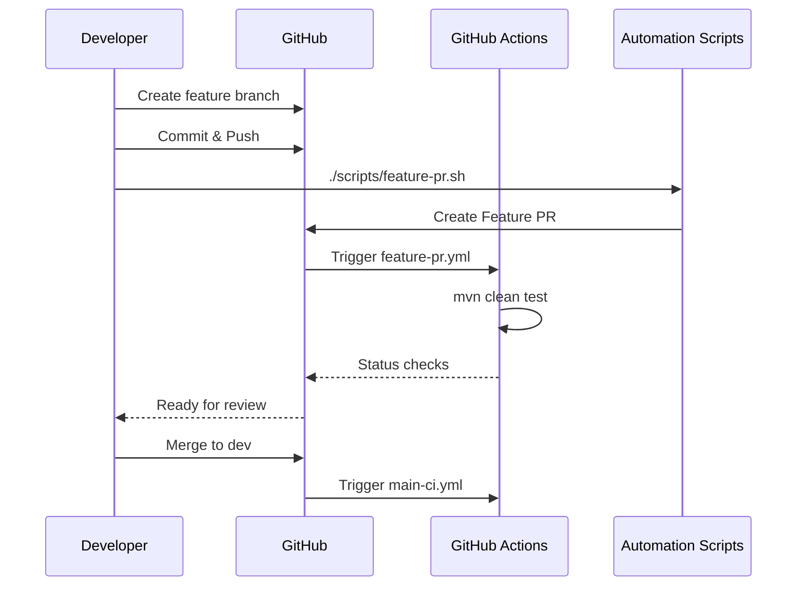

# 🚀 Playwright Java Hybrid Framework
**Playwright Core & First Test Implementation (v0.1.0)**


> Enterprise-grade automation framework foundation using Java, Playwright, TestNG, and milestone-driven CI/CD governance.

---

# 📚 Table of Contents

1. [Project Overview](#-project-overview)
2. [Implemented in v0.1.0](#-implemented-in-v010)
3. [Technical Architecture](#-technical-architecture)
4. [Test Execution Flow](#-test-execution-flow)
5. [Branching Strategy](#-branching-strategy)
6. [Versioning Scheme](#-versioning-scheme)
7. [Initial Setup](#️-initial-setup)
8. [Running Tests](#-running-tests)
9. [Repository Automation](#-repository-automation)
10. [Development Workflow](#-development-workflow)
11. [Future Roadmap](#-future-roadmap)
12. [Contributing](#-contributing)
13. [Author](#-author)
14. [License](#-license)

---

# 📌 Project Overview

This project establishes a scalable automation framework architecture focused on:

- Strong repository governance
- Milestone-driven development
- Automated CI/CD workflows
- Controlled dependency management
- Modern browser automation using Playwright

The framework evolves milestone-by-milestone to ensure every feature is production-ready before expansion.

---

## 🎯 Current Goals of v0.1.0

- Integrate Playwright Java bindings
- Configure TestNG lifecycle execution
- Implement the first browser automation test (`TC_001`)
- Enable Maven-based execution workflow
- Preserve governance and CI/CD standards introduced in `v0.0.0`

---

# ✅ Implemented in v0.1.0

## Added Dependencies

- Playwright `1.59.0`
- TestNG `7.12.0`

---

## Added Automation

- First real UI automation test (`TC_001`)
- Chromium browser execution
- Form interaction automation
- Assertion-based validation using TestNG

---

## Execution Support

```bash
mvn clean test
```

Surefire plugin execution enabled for Maven lifecycle integration.

---

## Execution Status

- Chromium automation verified
- Maven execution verified
- TestNG lifecycle verified
- Local execution validated successfully on Debian Linux

---

# 🧱 Technical Architecture

## 📁 Folder Structure

```text
playwright-hybrid-framework/
├── .github/
│   ├── features/
│   ├── issues/
│   ├── releases/
│   └── workflows/
│
├── scripts/
│   ├── feature-pr.sh
│   ├── release-pr.sh
│   ├── issues.sh
│   ├── milestones.sh
│   └── pom-validator.sh
│
├── src/
│   ├── main/java/
│   │
│   └── test/java/
│       └── tests/
│           └── TC_001.java
│
├── pom.xml
└── README.md
```

---

## 🧩 High-Level Component Diagram



---

# 🧪 Test Execution Flow



---

# 🌿 Branching Strategy

We follow a strict Git Flow governed by GitHub Branch Protection rules.



---

## Branch Definitions

| Branch | Purpose |
|---|---|
| `main` | Production-ready releases |
| `dev` | Integration branch |
| `feature/*` | Active feature development |

---

# 🧮 Versioning Scheme

The framework follows Semantic Versioning (SemVer).



---

## Current Version

```text
v0.1.0
```

---

# ⚙️ Initial Setup

## ✅ Prerequisites

- Java JDK `21`
- Maven `3.8+`
- Git `2.30+`
- GitHub CLI (`gh`) authenticated locally

---

## 💻 Installation

### Clone Repository

```bash
git clone https://github.com/opencode-qa/playwright-hybrid-framework.git

cd playwright-hybrid-framework
```

---

### Authenticate GitHub CLI

```bash
gh auth login
```

---

### Run POM Validation

```bash
./scripts/pom-validator.sh --strict --html
```

---

# 🧪 Running Tests

## Execute Full Test Lifecycle

```bash
mvn clean test
```

---

## Execute Single Test

```bash
mvn test -Dtest=TC_001
```

---

# 🧪 First Automated Test – TC_001

## Scenario

The framework now executes a real browser automation flow against:

- https://demoqa.com

---

## Test Steps

1. Launch Chromium browser
2. Navigate to DemoQA
3. Open Elements → Text Box
4. Fill all required fields
5. Submit the form
6. Verify output visibility using TestNG assertions

---

## 📊 Sample Terminal Output

```text
[INFO] -------------------------------------------------------
[INFO]  T E S T S
[INFO] -------------------------------------------------------
[INFO] Running tests.TC_001

========== TEST EXECUTION STARTED ==========
Browser launched successfully.
Navigated to DemoQA application.
Text Box Test Started.
Text Box Test Passed Successfully.

Closing browser...
Browser closed successfully.

========== TEST EXECUTION COMPLETED ==========

[INFO] Tests run: 1, Failures: 0, Errors: 0, Skipped: 0
[INFO] BUILD SUCCESS
```

---

# 🤖 Repository Automation

| Script | Purpose |
|---|---|
| `pom-validator.sh` | Validates milestone-gated dependencies/plugins |
| `feature-pr.sh` | Creates and updates feature PRs |
| `release-pr.sh` | Automates release versioning |
| `milestones.sh` | Synchronizes roadmap milestones |
| `issues.sh` | Batch creates GitHub issues |

---

# 🔁 Development Workflow



---

# 🛣️ Future Roadmap

| Version | Milestone | Status |
|---|---|---|
| `v0.0.0` | Project Skeleton & CI Setup | ✅ Done |
| `v0.1.0` | Playwright Core & First Test | ✅ Done |
| `v0.2.0` | Log4j2 Logging & Config Management | 🚧 Next |
| `v0.3.0` | Page Object Model Architecture | ⏳ Planned |
| `v0.4.0` | Data-Driven Framework | ⏳ Planned |
| `v0.5.0` | Advanced Playwright Features | ⏳ Planned |
| `v0.6.0` | Visual Regression Testing | ⏳ Planned |
| `v0.7.0` | Cross-Browser & Parallel Execution | ⏳ Planned |
| `v0.8.0` | Retry Logic & Listeners | ⏳ Planned |
| `v0.9.0` | Allure Reporting | ⏳ Planned |
| `v1.0.0` | Stable Enterprise Release | ⏳ Planned |

---

# 🤝 Contributing

```bash
# Create feature branch
git checkout -b feature/your-feature

# Commit changes
git commit -m "feat: add feature"

# Push branch
git push origin feature/your-feature

# Create automated PR
./scripts/feature-pr.sh
```

---

# 👨‍💻 Author

## ANUJ KUMAR

🏅 QA Lead & AI-Assisted Testing Specialist

📧 anujpatiyal@live.in

🔗 LinkedIn Profile

---

# 📜 License

Distributed under the MIT License.

---

> “First, solve the problem. Then, write the code.” – John Johnson

This framework prioritizes governance, automation architecture, and CI/CD quality gates before scaling test implementation.
